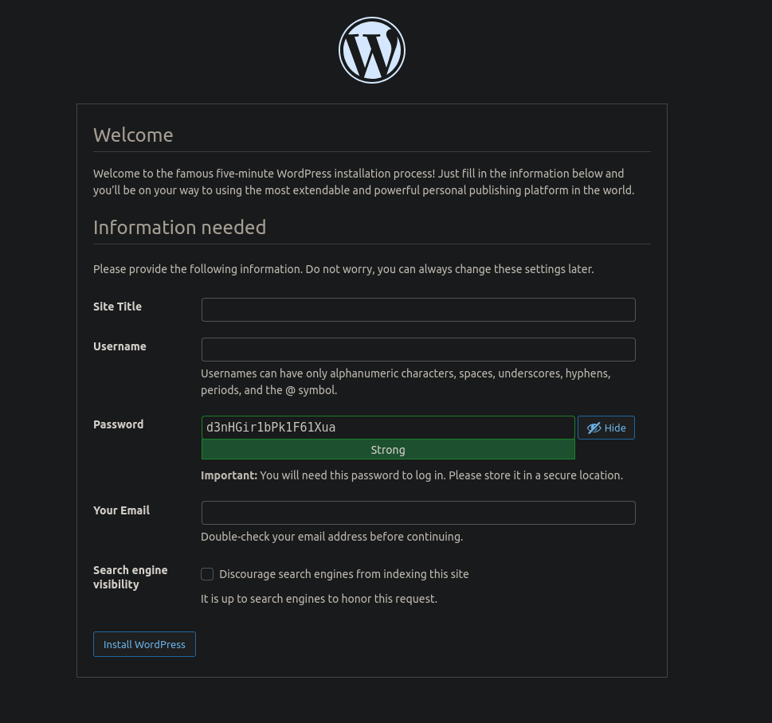

# Лабораторная 5. Взаимодействие контейнеров

## Выполнил: Виктор Анисимов

## Группа: IA2403

## Дата: 22.03.2026

## Цель

Выполнив данную работу студент сможет подготовить образ контейнера для запуска веб-сайта на базе Apache HTTP Server + PHP (mod_php) + MariaDB.

## Задание

Создать Dockerfile для сборки образа контейнера, который будет содержать веб-сайт на базе Apache HTTP Server + PHP (mod_php) + MariaDB. База данных MariaDB должна храниться в монтируемом томе. Сервер должен быть доступен по порту 8000.
Установить сайт WordPress. Проверить работоспособность сайта.

## Подготовка

- [x] install Docker
- [x] выполнить лабораторную работу №3

## Выполнение

Создаю структуру папок:

``` bash
tree -L 2
.
├── Dockerfile
├── files
│   ├── apache2
│   ├── mariadb
│   └── php
└── README.md
```

Собираю Dockerfile.

``` bash
docker image build -t apache2-php-mariadb .
```

Запускаю его в фоновом режиме командой:

``` bash
docker container run --name apache2-php-mariadb -d apache2-php-mariadb 
```

Копирую нужные файлы конфигурации из контейнера в локальную структуру папок:

``` bash
docker cp apache2-php-mariadb:/etc/apache2/sites-available/000-default.conf files/apache2/
docker cp apache2-php-mariadb:/etc/apache2/apache2.conf files/apache2/
docker cp apache2-php-mariadb:/etc/php/8.4/apache2/php.ini files/php/
docker cp apache2-php-mariadb:/etc/mysql/mariadb.conf.d/50-server.cnf files/mariadb/
```

Команды копирования успешно выполнены.

``` bash
tree -L 3
.
├── Dockerfile
├── files
│   ├── apache2
│   │   ├── 000-default.conf
│   │   └── apache2.conf
│   ├── mariadb
│   │   └── 50-server.cnf
│   └── php
│       └── php.ini
└── README.md
```

Удалил контейнер командой:

``` bash
docker container rm apache2-php-mariadb

Output:
apache2-php-mariadb
```

## Настройка конфигурационных файлов

### Apache2

В файле `000-default.conf` делаю следующие изменения:

1. Заменил `#ServerName www.example.com` и замените её на `ServerName localhost`

2. Заменил `ServerAdmin webmaster@localhost` на `ServerAdmin anisimov.victor@usm.md`

3. Добавил `DirectoryIndex index.php index.html`

В файле `apache2.conf` в конце добавил `ServerName localhost`

### PHP

В файле `php.ini` выполнил следующие изменения:

`;error_log = php_errors.log` заменил её на `error_log = /var/log/php_errors.log`

Тем самым я раскомментировал строку и задал значение другого вывода логов.

Изменил все параметры на необходимые:

``` ini
memory_limit = 128M ;максимальное количество памяти для php
upload_max_filesize = 128M ;ограничение загрузки слишком больших файлов пользователями
post_max_size = 128M ;ограничение размера максимального POST запроса. (должен быть >= чем upload_max_filesize)
max_execution_time = 120 ;ограничивает  максимальное время выполнения php скрипта
```

### mariadb

В файле `50-server.cnf` делаю следующие изменения:

Раскоментировал строку `#log_error = /var/log/mysql/error.log`

## Создание скрипта запуска

Создал файл `supervisor/supervisord.conf` с следующим содержимым:

``` conf
[supervisord]
nodaemon=true
logfile=/dev/null
user=root

# apache2
[program:apache2]
command=/usr/sbin/apache2ctl -D FOREGROUND
autostart=true
autorestart=true
startretries=3
stderr_logfile=/proc/self/fd/2
user=root

# mariadb
[program:mariadb]
command=/usr/sbin/mariadbd --user=mysql
autostart=true
autorestart=true
startretries=3
stderr_logfile=/proc/self/fd/2
user=mysql
```

Описание:

- Процесс **supervisord** может работать в двух режимах: by default - **Daemon**;  **Foreground**. \
    Разница в том, что daemon делает отдельный процесс  независимо от терминала, а foreground закрепляется за терминалом и при завершения процесса ctrl + C завершает все подпроцессы.
    >[!NOTE]
    >
    >При поднятии демона в докере, **демон создаёт новый процесс и завершает главный** (supervisord - PID 1). Докер в свою очередь видит, что главный процесс контейнера завершился следовательно завершает все процессы контейнера, вместе с демоном. \
    >При поднятии контейнера с режимом supervisord foreground **процесс не отделяется и не завершается основной**.
- `[program:apache2]` определяет программу Apache для управления. \
    `command=/usr/sbin/apache2ctl -D FOREGROUND` запускает Apache в foreground режиме.\
    `autostart=true` автозапуск при старте supervisord.\
    `autorestart=true` перезапуск при сбоях.\
    `startretries=3` 3 попытки запуска при ошибках.\
    `stderr_logfile=/proc/self/fd/2` ошибки пишутся в stderr родительского процесса.

    >[!NOTE] 
    >
    >`/proc/self` это симлинк на текущий процесс (тот, кто читает)
    >
    >`/proc/self/fd/2` это file descriptor 2 (STDERR) этого же процесса
    >
    >`/proc/self/fd/1` это STDOUT того же процесса

- `command=/usr/sbin/mariadbd --user=mysql` запускает mariadbd от пользователя mysql.
    Остальные параметры аналогичны Apache: автозапуск, перезапуск, 3 попытки, ошибки в stderr.

## Настройка Dockerfile

Добавил после инструкции `FROM` следующий код:

``` dockerfile
# mount volume for mysql data
VOLUME /var/lib/mysql

# mount volume for logs
VOLUME /var/log
```

Добавил в установку пакет *supervisor*.

Добавил копирование сайта WordPress и конф. файлов в контейнер:

``` dockerfile
# add wordpress files to /var/www/html
ADD https://wordpress.org/latest.tar.gz /var/www/html/

# copy the configuration file for apache2 from files/ directory
COPY files/apache2/000-default.conf /etc/apache2/sites-available/000-default.conf
COPY files/apache2/apache2.conf /etc/apache2/apache2.conf

# copy the configuration file for php from files/ directory
COPY files/php/php.ini /etc/php/8.2/apache2/php.ini

# copy the configuration file for mysql from files/ directory
COPY files/mariadb/50-server.cnf /etc/mysql/mariadb.conf.d/50-server.cnf

# copy the supervisor configuration file
COPY files/supervisor/supervisord.conf /etc/supervisor/supervisord.conf
```

Создаю папку `/var/run/mysql` и выдаю права на неё:

``` dockerfile
# create mysql socket directory
RUN mkdir /var/run/mysqld && chown mysql:mysql /var/run/mysqld
```

Добавляю команду запуска *supervisord*:

``` dockerfile 
# start supervisor
CMD ["/usr/bin/supervisord", "-n", "-c", "/etc/supervisor/conf.d/supervisord.conf"] 
```

Удалил контейнер, пересобрал образ, запустил контейнер, проверил - все изменения перенеслись в контейнер.

Команда запуска теперь:

``` bash
docker run --name apache2-php-mariadb -p 8000:80 -d apache2-php-mariadb
```

Пробрасываю порт 80 из контейнера на порт 8000 хоста, запускаю на фоне.

Запускаю интерактивное взаимодействие с контейнеров командой:

``` bash
docker exec -it apache2-php-mariadb bash
```

Выполняю создание БД и присвоение всех прав для только что созданного пользователя.

``` bash
root@6bc73be3b9c2:/# mysql

MariaDB [(none)]> CREATE DATABASE wordpress;
Query OK, 1 row affected (0.003 sec)

MariaDB [(none)]> CREATE USER 'wordpress'@'localhost' IDENTIFIED BY 'wordpress';
Query OK, 0 rows affected (0.004 sec)

MariaDB [(none)]> GRANT ALL PRIVILEGES ON wordpress.* TO 'wordpress'@'localhost';
Query OK, 0 rows affected (0.004 sec)

MariaDB [(none)]> FLUSH PRIVILEGES;
Query OK, 0 rows affected (0.002 sec)

MariaDB [(none)]> EXIT;
Bye
```

После попыток запустить - столкнулся с проблемой: архив wordpress распаковывается по нужному пути, но в подпапку *wordpress* - из-за чего сайт по адресу localhost выдавал apache2 default page.

Для решения заменил в dockerfile инструкцию add на run получение и распаковку (для этого так же пришлось добавить два пакета в контейнер **curl** и **tar**):

``` dockerfile
RUN curl -L -o /tmp/wp.tar.gz https://wordpress.org/latest.tar.gz && \
    tar -xz -f /tmp/wp.tar.gz -C /var/www/html --strip-components=1
```

`--strip-components=1` удаляет первый уровень вложенности - саму папку wordpress.

Я ввёл данные на сайт wordpress и получил готовый конф. файл. Скопировать его и сохранил по пути `files/wp-config.php`.

Добавил в Dockerfile автоматическое копирование данного коф. файла командой:

``` dockerfile
COPY files/wp-config.php /var/www/html/wp-config.php
```



## Вывод

Научился поднимать несколько сервисов не использую docker-compose через supervisord.

## Ответы на вопросы

1. Какие файлы конфигурации были изменены?

    - 000-default.conf
    - apache2.conf
    - 50-server.cnf
    - php.ini
    - supervisord.conf
    - wp-config.php

2. За что отвечает инструкция DirectoryIndex в файле конфигурации apache2?

    Определяет порядок отправки файла по основному **GET** запросу: сначала попытается отправить `index.php`. \
    Если его не будет - попытается отправить `index.html`
3. Зачем нужен файл wp-config.php?

    Определяет имя бд, имя пользователя бд, пароль. А так же настраивает безопасность, режимы работы и интеграцию с сервером.
4. За что отвечает параметр post_max_size в файле конфигурации php?

    Ответил [здесь](#php):
    > ограничение максимального размера POST запроса. (должен быть >= чем upload_max_filesize)

5. Укажите, на ваш взгляд, какие недостатки есть в созданном образе контейнера?

    Всё в одном контейнере - легче было бы управлять разделёнными контейнерами в особенности для длительного поддерживания проекта.